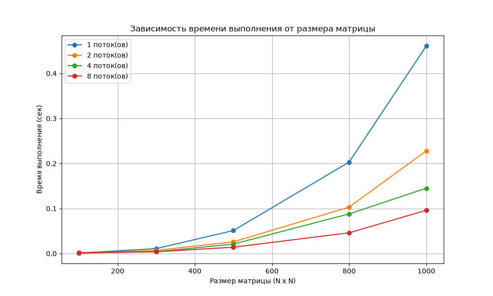
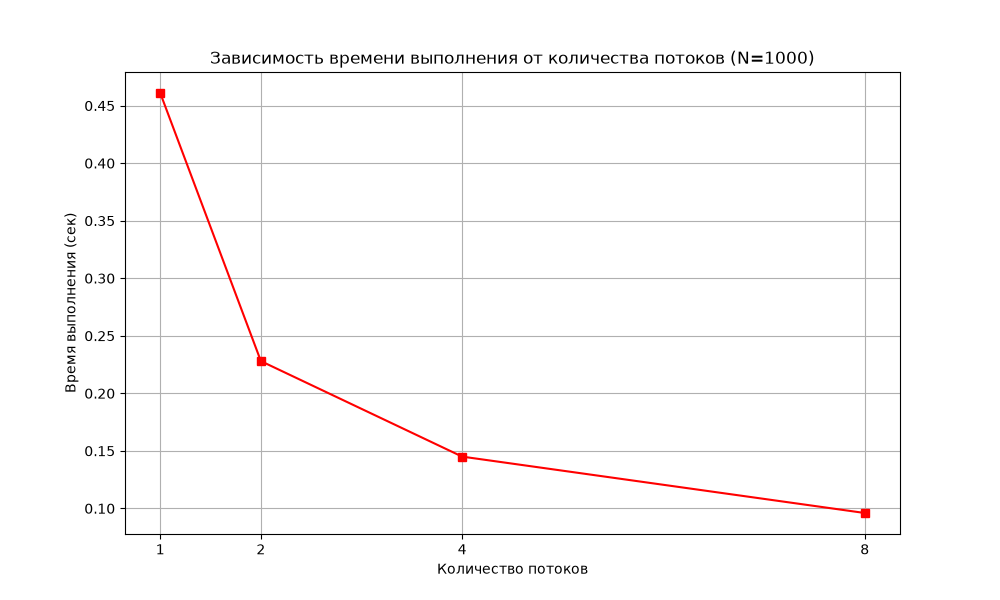
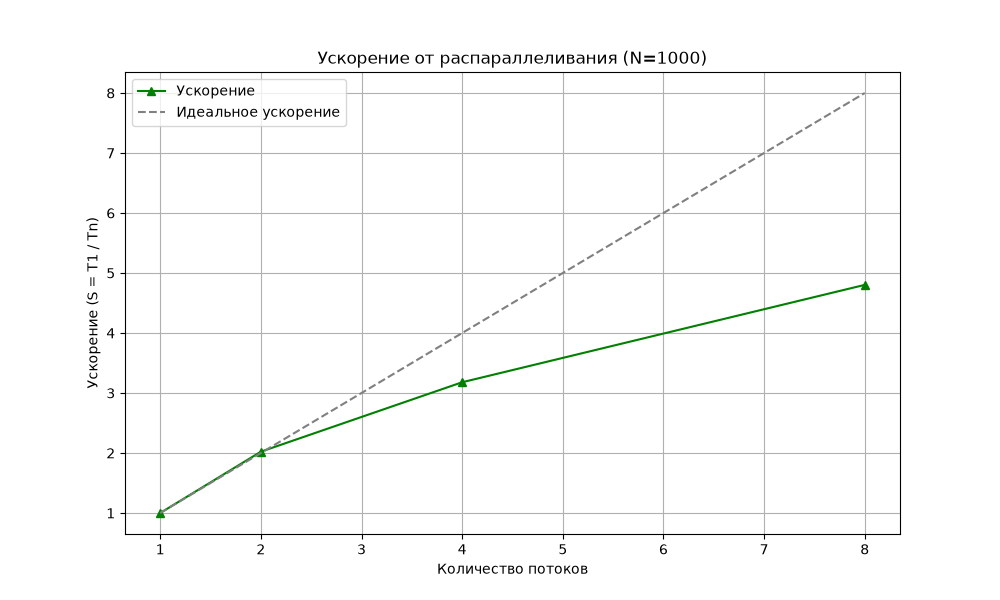

# Лабораторная работа №1

Выполнила: Некрасова Мария Вадимовна\
Группа: 6213-100503D
---
## Задание: 
Написать программу на языке C/C++ для перемножения двух квадратных матриц.
Исходные данные: файлы со значениями исходных матриц.
Выходные данные: файл с результирующей матрицей, время выполнения, объём задачи.

Обязательна автоматизированная верификация результатов с помощью сторонних библиотек (NumPy).
---
### Назначение файлов

| Файл                        | Назначение                                                          |
|-----------------------------|---------------------------------------------------------------------|
| `src/matrix_mult.cpp`       | Программа на C++ с OpenMP для перемножения матриц.                  |
| `src/generator.py`          | Генератор исходных матриц A и B.                                    |
| `src/experiment.py`         | Автоматизация экспериментов и построение графиков.                  |
| `src/verify.py`             | Верификация результатов с помощью NumPy.                            |
| `results/experiment_results.csv` | Таблица с замерами времени и GFLOPS.                           |
| `results/plots/`            | Папка с графиками (PNG).                                            |
| `.gitignore`                | Список файлов, которые не загружаются в Git.                        |
---
## Реализация алгоритма

Перемножение матриц `C = A × B` реализовано с помощью тройного цикла в порядке `i-k-j` (для лучшей локальности кэша):

```cpp
#pragma omp parallel for
for (int i = 0; i < N; ++i) {
    for (int k = 0; k < N; ++k) {
        double a_ik = A[i][k];
        for (int j = 0; j < N; ++j) {
            C[i][j] += a_ik * B[k][j];
        }
    }
}
```
## Результаты экспериментов
### Зависимость времени от размера матрицы



### Зависимость времени от количества потоков (N=1000)



### Ускорение от распараллеливания (N=1000)



### Таблица результатов (фрагмент)

| Размер (N) | Потоки | Время (сек) |       GFLOPS       | 
|------------|--------|-------------|--------------------|
| 1000       | 1      |    0,461    | 4.3383947939262475 |   
| 1000       | 2      |    0,228    | 8.771929824561404  |
| 1000       | 4      |    0,145    | 13.793103448275861 |
| 1000       | 8      |    0,096    | 20.833333333333332 |

---
## Выводы

1. Корректность: Результаты C++ полностью совпадают с эталоном NumPy
2. Эффективность: С ростом потоков время снижается
3. Закон Амдала: Последовательные участки (ввод-вывод) ограничивают максимальное ускорение
